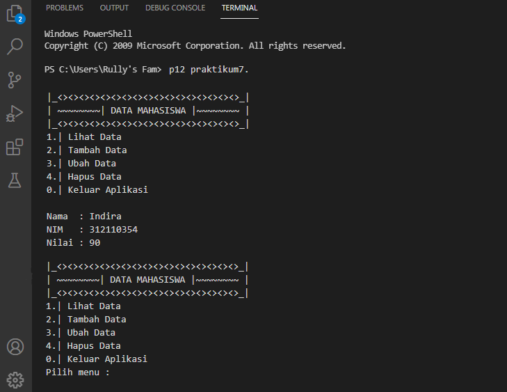

# praktikum7

## Tugas pertemuan 12 - Mengaplikasikan diagram class

================================

= Nama  : Indira Rully Pricilia

= NIM   : 312110354

= Kelas : TI.21.CA.1

=================================

### Tugas Praktikum

Ini source code dari program class nya :
```ruby
# Indirarully
# definisi class
#include<iostream>

class mahasiswa():
      ''' Dasar kelas untuk nilai mahasiswa'''
      jumlah_mahasiswa = 0

     def __init__(self, nama, nilai, nim):
         self.nama  = nama
         self.nilai = nilai
         self.nim   = nim
         Mahasiswa.jumlah_mahasiswa += 1

     def tampilkan_jumlah(self):
         print("Total mahasiswa :" , Mahasiswa.jumlah_mahasiswa)

     def tampilkan_profil(self):
         print("Nama  :", self.nama)
         print("Nilai :", self.nilai)
         print("Nim   :", self.nim)

     def hapus():
         print("Hapus Data Nilai Mahasiswa")
               nama = input(" Masukan Nama\t:")
         if nama in data.keys():
            del data[nama]
         print()
         print("~~~~~~~~~~~~~~~~~~~~~~~~~~~~~~~~~")
         print("===| BERHASIL MENGHAPUS DATA |===")
         print("~~~~~~~~~~~~~~~~~~~~~~~~~~~~~~~~~")
     else:
         print("Data {0} tidak ada".format(nama))


     def ubah():
         print nama = input("Masukan Nama\t\t: ")
         if nama in data.keys():
            nim = input("NIM baru\t\t\t: ")
            nilai = input("Nilai baru\t\t\t: ")
        data[nama] = nim, nilai
        print()
        print("data berhasil di ubah")
    else:
        print("Data nilai {0} tidak ada ".format(nama))


    while True:
        print("")
        print("|_<><><><><><><><><><><><><><><><><>_|")
        print("|~~~~~~~~| DATA MAHASISWA |~~~~~~~~~~|")
        print("|_<><><><><><><><><><><><><><><><><>_|")
              x = input("1.| Lihat Data \n2.| Tambah Data \n3.| Ubah Data \n4.| Hapus Data \n0.| Keluar Aplikasi \nPilih menu : ")
        if x.lower() == "1":
           tampilkan()
        elif x.lower() == "2":
           tambah()
        elif x.lower() == "3":
           ubah()
        elif x.lower() == "4":
           hapus()
        elif x.lower() == "0":

        print()
        print("<><><><><><><><><><><><><><><><>")
        print("====== KELUAR DARI PROGRAM ======")
        print("<><><><><><><><><><><><><><><><>")
        break

    else:
        print()
        print("<><><><><><><><><><><><><><><><>")
        print("== Pilihan Anda Tidak Tersedia ==")
        print("== Pilihlah Menu Yang Tersedia ==")
        print("<><><><><><><><><><><><><><><><>")

# Membuat objek di kelas mhs
Indira = mahasiswa('Indira, 90, 312110354')
Pricilia = mahasiswa('Pricilia, 87, 312000000')

    def cetak(self):
        print("\nNama: {}\nNilai: {}\.format(self.nama, self.nilai, self.nim)")

print()
```
Terdapat 5 Pilihan menu, yaitu :

= 1. Lihat Data

= 2. Tambah Data

= 3. Ubah Data

= 4. Hapus Data

= 0. Keluar Aplikasi


**1) Lihat Data Nilai Mahasiswa**

System akan menjalankan fitur ini ketika user mengetikkan perintah 1 pada pilihan Pilih Menu (1-2-3-4-5) Inilah tampilan fitur Lihat Data :



**2) Menambahkan Data**

Fitur ini akan menambahkan data menggunakan menu perintah 2 pada menu 1-2-3-4-5, misal saya ingin menambah data mahasiswa seperti ini jika digabung :


**3) Fitur ubah data**

Pada fitur ini user akan diminta untuk memilih data siapa dan data apa yang akan dirubah, misal saya ingin merubah nama dan nilai. Ini source code dan outputnya :
```ruby
Rully.nama    = 'Rully' # mengubah nama atribut
Rully.nim     = '312345' # mengubah nim atribut
Rully.nilai   = '70' # mengubah nilai atribut

print(Rully.nama) # mengakses atribut
print(Rully.nilai) # mengakses atribut
print(Rully.nim) # mengakses atribut

Rully.cetak() # memanggil fungsi / method
```


**4) Fitur Hapus Data Nilai Mahasiswa**

System akan menjalankan fitur ini ketika user mengetikkan perintah 4 pada pilihan Pilih Menu (1-2-3-4-5) dan data akan hilang. Berikut outputnya :


### Flowchart dan diagram class
Dan berikut adalah Hasil Flowchart beserta diagram class nya


*Sekian penjelasan praktikum 7, terimakasih atas perhatiannya..*

#### Indira Rully Pricilia - 312110354 - TI.21.CA.1
